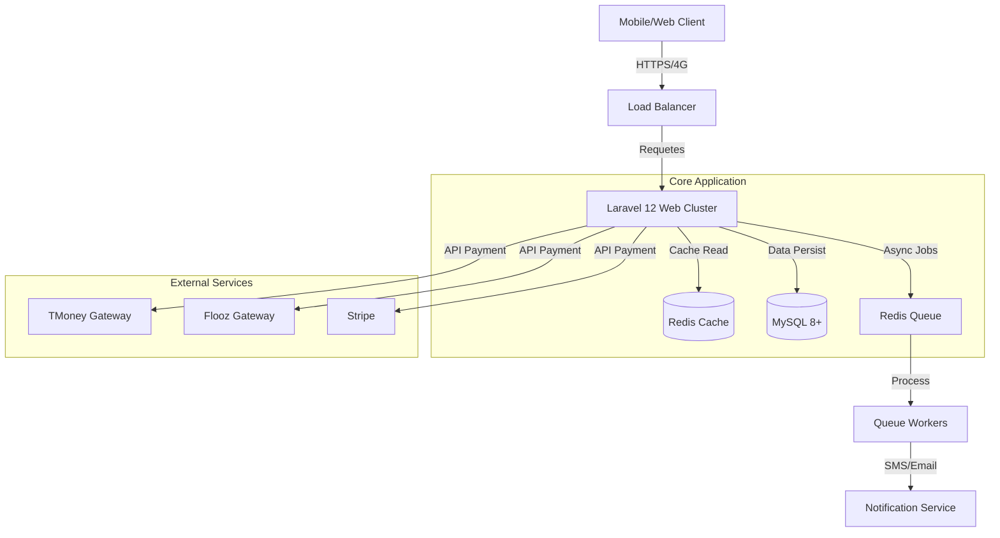

# Architecture Technique & Roadmap 2026 - EDX E-Commerce
**Version:** 2.0 (Laravel 12.x Edition)
**Date:** Février 2026
**Auteur:** Architecte Principal EDX
**Statut:** Approuvé pour développement

---

## 1. Vue d'Ensemble & Architecture Système

L'objectif est de transformer l'actuel monolithe Laravel en une **plateforme modulaire orientée services**, capable de supporter la charge du marché Ouest-Africain (faible bande passante, haute latence, mobile-first).

### 1.1 Diagramme de Flux de Données (Haut Niveau)


### 1.2 Stack Technologique Mise à Jour
- **Backend**: Laravel 12.x (Utilisation de `Context`, `Defer` et `Sleep` helpers).
- **Frontend**: Blade + Alpine.js v3 (Interactivité légère) + Tailwind CSS v4.
- **Cache & Session**: Redis (Clusterisé en production).
- **Search Engine**: MySQL Fulltext (Phase 1) -> Meilisearch (Phase 2).
- **Asset Bundling**: Vite avec compression Brotli/Gzip agressive.

---

## 2. Architecture de Base de Données (Optimisation & Multi-tenancy)

### 2.1 Multi-tenancy "Enterprise" (Structure Hybride)
Nous adoptons une approche **Multi-tenancy par données** (Shared Database, discrimiinated by `enterprise_id`), plus simple à maintenir qu'une approche Multi-database.

**Nouvelle Relation : `Enterprise` <-> `User` (Many-to-Many)**
Cela permet à un utilisateur d'être "Vendeur" pour plusieurs boutiques ou "Staff" avec des permissions granulaires.

```php
// Schéma de migration : create_enterprise_user_table.php
Schema::create('enterprise_user', function (Blueprint $table) {
    $table->id();
    $table->foreignId('enterprise_id')->constrained()->cascadeOnDelete();
    $table->foreignId('user_id')->constrained()->cascadeOnDelete();
    $table->string('role')->default('staff'); // owner, manager, staff
    $table->json('permissions')->nullable(); // ['manage_products', 'manage_orders']
    $table->timestamps();
    
    $table->unique(['enterprise_id', 'user_id']);
});
```

### 2.2 Module Fintech (Portefeuille & Transactions)
Pour gérer les **commissions marketplace** et les paiements vendeurs, nous introduisons un système de **Double Entry Ledger** (Comptabilité à double entrée simplifiée).

**Tables Requises :**
1. `wallets`: Solde virtuel par Utilisateur/Entreprise.
2. `transactions`: Historique immuable.

```php
// Schéma : create_wallets_table.php
Schema::create('wallets', function (Blueprint $table) {
    $table->id();
    $table->morphs('holder'); // User ou Enterprise
    $table->decimal('balance', 15, 2)->default(0);
    $table->string('currency', 3)->default('XOF');
    $table->boolean('is_frozen')->default(false);
    $table->timestamps();
});

// Schéma : create_transactions_table.php
Schema::create('transactions', function (Blueprint $table) {
    $table->uuid('id')->primary();
    $table->foreignId('wallet_id')->constrained();
    $table->string('type'); // deposit, withdrawal, payment, commission, refund
    $table->decimal('amount', 15, 2); // Peut être négatif
    $table->boolean('confirmed')->default(false);
    $table->json('meta')->nullable(); // Order ID, Payment Gateway Ref
    $table->string('reference_unique')->unique(); // Idempotency key
    $table->timestamps();
});
```

---

## 3. Logique de Paiement & Sécurisation (Pattern Strategy)

Nous devons abstraire la logique de paiement pour supporter TMoney, Flooz et Stripe de manière interchangeable.

### 3.1 Pattern : PaymentGatewayInterface
```php
interface PaymentGatewayInterface {
    public function initiatePayment(Order $order): PaymentResponse;
    public function verifyWebhook(Request $request): WebhookResult;
    public function processRefund(string $transactionId): bool;
}
```

### 3.2 Contrôleur de Paiement (Pseudo-code Optimisé)
```php
class PaymentController extends Controller
{
    public function initialize(Request $request, Order $order, PaymentService $service)
    {
        // 1. Validation de l'intégrité de la commande
        if ($order->status !== OrderStatus::PENDING) {
            abort(400, 'Commande déjà traitée');
        }

        // 2. Sélection du Gateway
        $gateway = PaymentGatewayFactory::make($request->payment_method); // 'tmoney', 'flooz'

        // 3. Initiation (Laravel 12 "Defer" pour logging asynchrone)
        defer(fn() => Log::info("Payment Init", ['order' => $order->id]));

        try {
            $response = $gateway->initiatePayment($order);
            return redirect($response->redirectUrl);
        } catch (PaymentException $e) {
            return back()->withErrors($e->getMessage());
        }
    }

    public function webhook(Request $request, string $provider)
    {
        // 1. Sécurisation Signature (HMAC)
        $gateway = PaymentGatewayFactory::make($provider);
        if (!$gateway->verifySignature($request)) {
            abort(403, 'Invalid Signature');
        }

        // 2. Verrouillage Atomique (Redis Lock) pour éviter double-crédit
        return Cache::lock("payment_webhook_{$request->ref}", 10)->block(5, function () use ($gateway, $request) {
            
            // Traitement Idempotent
            $tx = Transaction::where('reference_unique', $request->ref)->first();
            if ($tx && $tx->confirmed) return response('OK');

            // 3. Mise à jour Commande & Wallet
            DB::transaction(function () use ($gateway, $request) {
                // ... Logique comptable ...
            });

            return response('Payment Processed');
        });
    }
}
```

---

## 4. Performance & Scalabilité (Mobile First)

### 4.1 Stratégie de Caching (Redis)
- **Taggin de Cache**: Utiliser `Cache::tags(['products', 'category:12'])` pour invalider intelligemment le cache lors d'une mise à jour produit.
- **Vue Fragment Caching**: Mettre en cache les composants lourds (Menu, Footer) dans Blade.
  ```blade
  @cache('navbar', 60)
      <x-navbar />
  @endcache
  ```

### 4.2 Optimisation des Assets (Vite & Images)
- **Conversion WebP Automatique**: À l'upload (via `Spatie Media Library` ou Custom Action), convertir toutes les images en WebP q=80.
- **Lazy Loading Native**: `` sur toutes les images sous la ligne de flottaison.
- **Alpine.js**: Utiliser `x-data` pour la logique locale afin d'éviter les appels serveur inutiles (ex: recalcul panier instantané côté client).

---

## 5. Roadmap Technique (Séquençage)

### Phase 1 : Fintech Core (Semaines 1-2)
- [ ] Création tables `wallets`, `transactions`.
- [ ] Implémentation `PaymentGatewayInterface`.
- [ ] Intégration TMoney & Flooz (Sandbox).
- [ ] Webhook Security Middleware.

### Phase 2 : Multi-Tenancy & Enterprise (Semaines 3-4)
- [ ] Création `enterprise_user` & Roles.
- [ ] Dashboard Entreprise (Vue dédiée `/enterprise/dashboard`).
- [ ] Logique de commission (System Wallet vs Vendor Wallet).

### Phase 3 : Services & Booking (Semaines 5-6)
- [ ] Calendrier de disponibilité (Table `bookings`).
- [ ] Flux de réservation de service (similaire au checkout produit mais sans livraison).

### Phase 4 : Hardening & Production (Semaine 7)
- [ ] Tests de charge (K6).
- [ ] Security Audit (Injections SQL, XSS, CSRF).
- [ ] Déploiement CI/CD pipeline.
